# gnokey-tui — User Guide

A friendlier terminal UI for [`gnokey`](../../../gno.land/cmd/gnokey), gno.land's
command-line wallet and chain client. It wraps the real `gnokey` binary in
guided screens: menus instead of remembered flags, formatted output instead of
raw JSON, a live preview of every command before it runs, and a built-in gas
estimator. Every action runs an actual `gnokey` command — nothing here
re-implements signing, key storage, or crypto.

- [Requirements](#requirements)
- [Install & run](#install--run)
- [The interface](#the-interface)
- [Networks](#networks)
- [Keys](#keys)
- [Password handling](#password-handling)
- [Querying on-chain state](#querying-on-chain-state)
- [Account overview](#account-overview)
- [Sending, calling, running, deploying](#sending-calling-running-deploying)
- [Airgapped & watch-only signing](#airgapped--watch-only-signing)
- [Settings](#settings)
- [Troubleshooting](#troubleshooting)

---

## Requirements

- **Node.js ≥ 20**
- **`gnokey`** installed and on your `PATH`. Build it from the monorepo root with
  `make install.gnokey`. If it lives elsewhere, set its path in **Settings**.

## Install & run

```bash
cd misc/gnokey-tui
npm install
npm start
```

You can also point it at a specific account on launch (see
[Airgapped & watch-only signing](#airgapped--watch-only-signing)):

```bash
npm start -- --address g1youraddress…    # act as any address (watch-only ok)
npm start -- --account mykey             # act as a keybase key, by name
```

Flags: `-a, --address <bech32>`, `--account <name>`, `-h, --help`,
`-v, --version`.

## The interface

Everything is a menu. Use **↑ ↓** to move, **⏎** to select, **esc** to go back,
and **q** to quit from the home screen. The bottom strip always shows the active
network, chain ID, RPC endpoint, home directory, gnokey version, and key count.

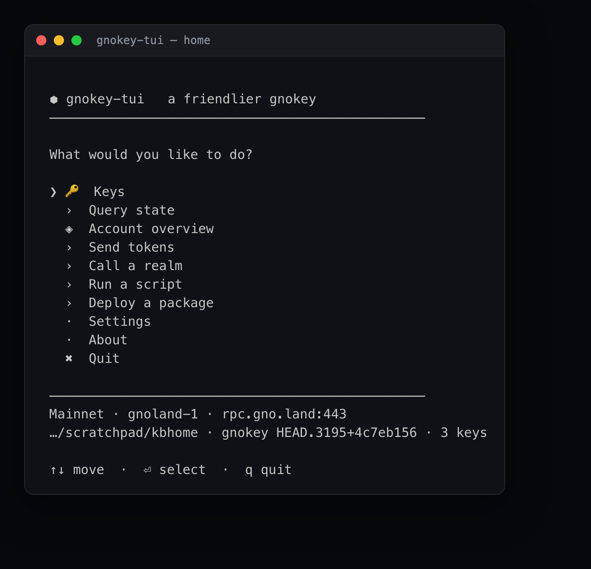

## Networks

The tool ships with presets and defaults to **Mainnet** (`rpc.gno.land`, chain
ID `gnoland-1`). Switch networks under **Settings › Choose network preset**:

| Preset | Endpoint | Chain ID |
|--------|----------|----------|
| **Mainnet** (default) | `https://rpc.gno.land:443` | `gnoland-1` |
| Staging | `https://rpc.staging.gno.land:443` | `staging` |
| Pearl / Test16 | `https://rpc.pearl.testnets.gno.land:443` | `pearl-1` |
| Local node | `http://127.0.0.1:26657` | `dev` |

You can also set a custom remote URL and chain ID. The chain ID matters: it is
baked into every signature, so signing against the wrong one produces an invalid
transaction.

## Keys

The **Keys** screen lists everything in your keybase — local signing keys,
Ledger references, watch-only public keys, and multisig references — with a
type badge and address.

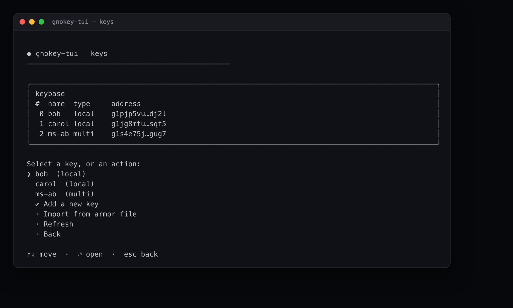

Select a key to see its details and per-key actions (account overview, export,
delete).

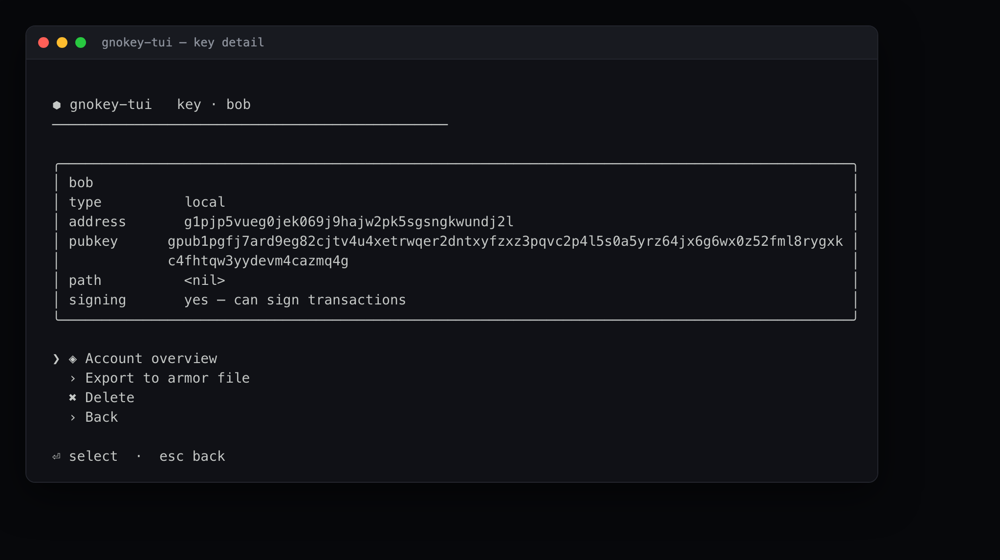

From the Keys screen you can:

- **Add a new key** — generates a fresh mnemonic (shown once — write it down).
- **Recover** — restore a key from an existing BIP39 mnemonic.
- **Generate a mnemonic** — without saving a key.
- **Import from armor file** — load an encrypted armor export.
- **Export** (per key) — write an encrypted armor file for backup.
- **Delete** (per key) — requires typing the key name to confirm.

How each of these asks for your password depends on your
[password handling](#password-handling) setting.

## Password handling

Unlocking a key (to sign or export) needs its password. Choose how that password
reaches gnokey under **Settings › Password handling**:

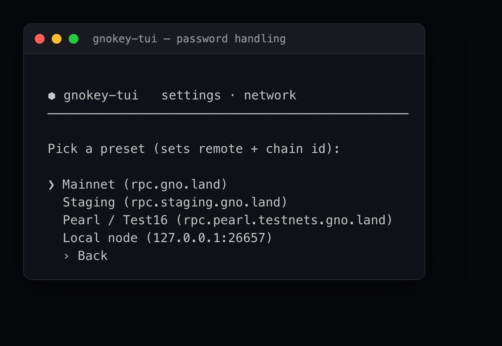

| Mode | How it works | Password enters gnokey-tui? |
|------|--------------|------------------------------|
| **Prompt in terminal** (default) | gnokey-tui steps aside and gnokey asks for the password itself, with no echo | No |
| **OS keychain (gnokeykc)** | commands run through [`gnokeykc`](../../../contribs/gnokeykc), which reads the password from your OS keychain (set once with `gnokeykc kc set`) | No |
| **Send via stdin** | gnokey-tui collects the password and pipes it to gnokey (`-insecure-password-stdin`) | Yes — opt-in, for scripting on a trusted machine |

Two things skip passwords entirely:

- **Ledger keys** sign on-device, so they always run in the terminal-prompt path.
- **Airgapped signing** never signs here at all — see below.

In every mode the password is kept out of the command line, so the preview shown
before a transaction is always safe to read. The default keeps the password out
of this tool completely.

## Querying on-chain state

**Query state** reads the chain with no gas and no signing. Pick an endpoint,
fill in the inputs, and the result is formatted for you (JSON pretty-printed,
function lists as signatures, gas price as a rate).

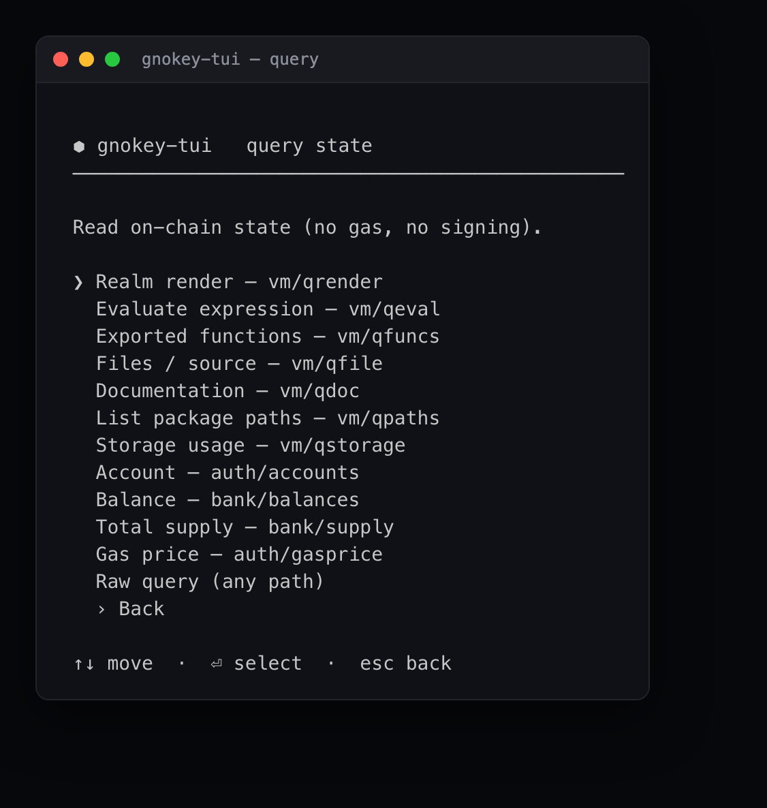

Supported queries: realm render (`vm/qrender`), evaluate expression
(`vm/qeval`), exported functions (`vm/qfuncs`), files/source (`vm/qfile`),
documentation (`vm/qdoc`), package paths (`vm/qpaths`), storage usage
(`vm/qstorage`), account (`auth/accounts`), balance (`bank/balances`), total
supply (`bank/supply`), gas price (`auth/gasprice`), and a raw query for any
path.

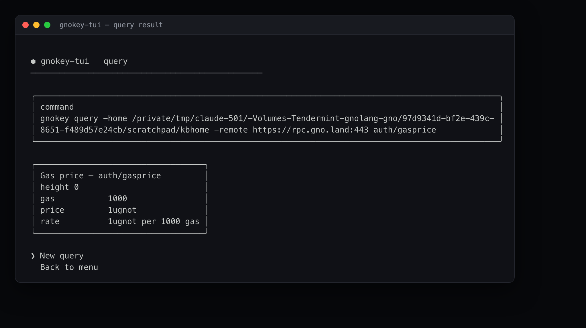

## Account overview

**Account overview** combines balance, account number, sequence, public key, and
the current network gas price for any key or address. ugnot amounts are shown as
GNOT alongside the raw value.

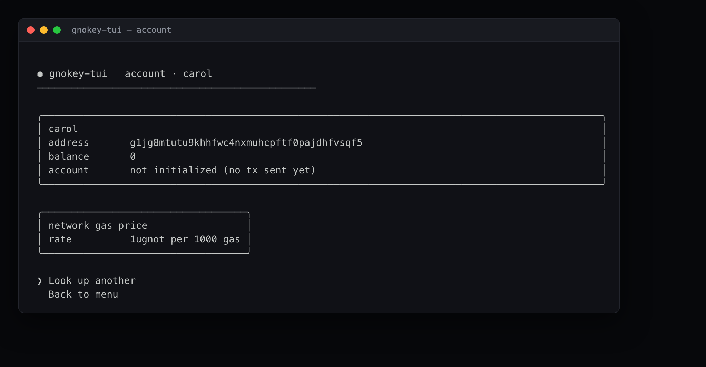

## Sending, calling, running, deploying

The home menu has an entry for each transaction type — **Send tokens**
(`maketx send`), **Call a realm** (`maketx call`), **Run a script**
(`maketx run`), and **Deploy a package** (`maketx addpkg`). Each follows the same
shape:

1. Pick the account to act as.
2. Fill a guided form (recipient, amount, gas, function args, etc.). Arguments
   are passed to gnokey verbatim — no shell quoting needed.
3. Review the **exact `gnokey` command** that will run, and how the password will
   be supplied.
4. Optionally **estimate gas** with a dry run (does not spend gas or move funds),
   then **broadcast** — or export the unsigned transaction.

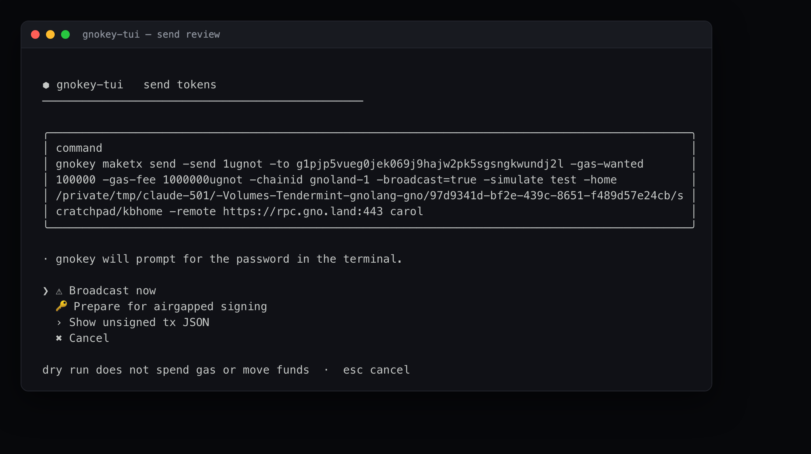

The review always offers **Show unsigned tx JSON** and **Prepare for airgapped
signing** in addition to broadcasting.

## Airgapped & watch-only signing

The tool can act as any address — including one whose key it does not hold — to
prepare a transaction for an offline signer. Set the account on launch:

```bash
gnokey-tui --address g1yoursigner…   # any bech32; need not be in the keybase
gnokey-tui --account mykey           # a keybase key, by name
```

The acting account is shown in the status bar. You can also choose **"Enter a
watch-only address"** inside any transaction flow.

When the acting account cannot sign here, the transaction review offers
**Prepare for airgapped signing**, which builds the unsigned tx with gnokey
(using `-master` for an address not in the keybase, so it carries gnokey's exact
encoding):

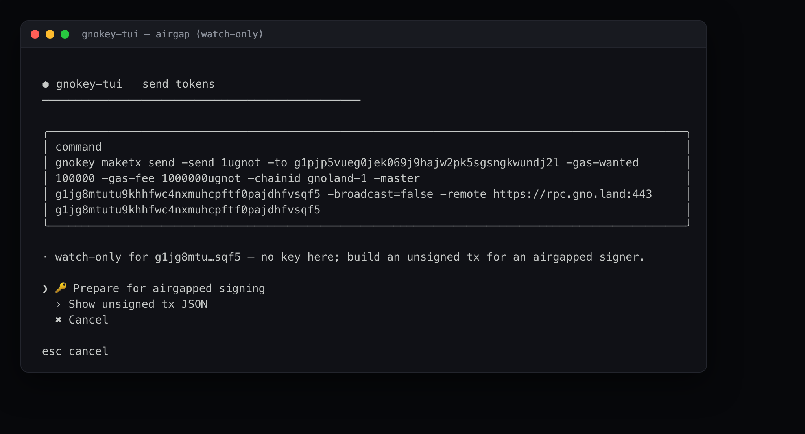

Choosing it writes the unsigned tx to a file, queries the account number and
sequence, and prints the two commands to run — `gnokey sign …` on the offline
machine that holds the key, then `gnokey broadcast …` back on this online
machine:

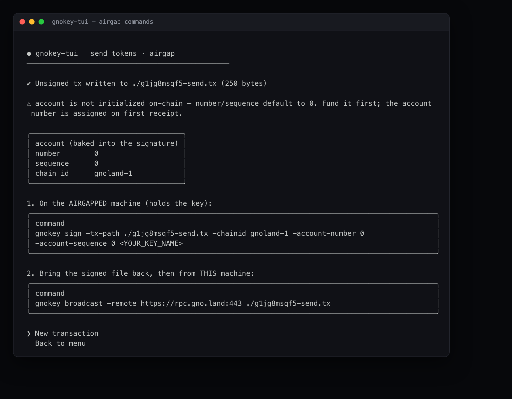

If the account is not yet on-chain, the account number and sequence default to
`0` with a warning — fund the account first; its number is assigned on first
receipt.

## Settings

**Settings** shows the current configuration and lets you change the network,
password handling, remote URL, chain ID, home directory, and the gnokey /
gnokeykc binary paths. Changes save immediately to
`~/.config/gnokey-tui/config.json`.

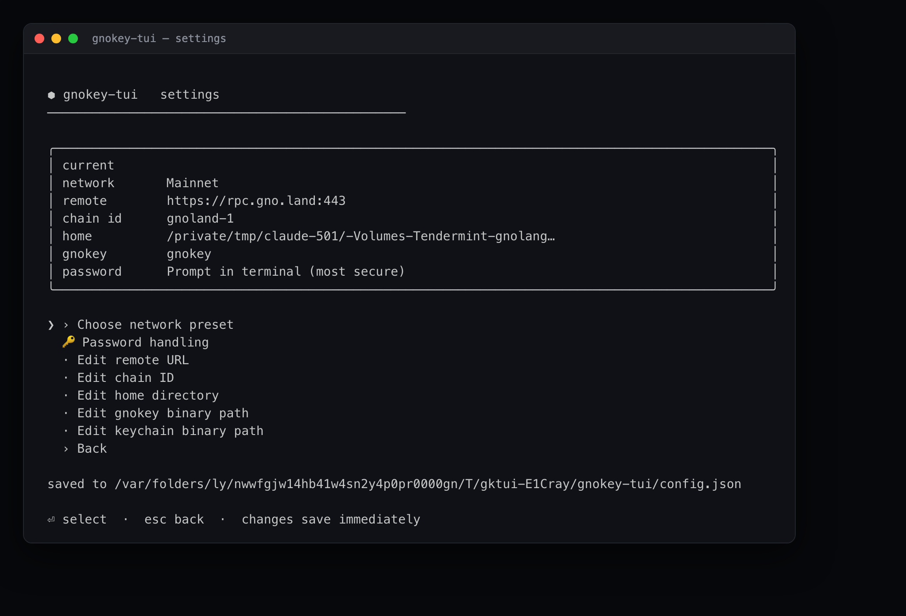

## Troubleshooting

- **"gnokey is not reachable" on startup** — the binary isn't on your `PATH`.
  Choose "Set path to the gnokey binary" and enter its full path, or install it
  with `make install.gnokey`.
- **A transaction fails at simulation** — the dry run catches errors before
  broadcasting, so nothing was spent. Read the reported error; common ones are
  insufficient gas fee and out-of-gas (raise `-gas-wanted`).
- **Keychain mode errors about a missing password** — run `gnokeykc kc set` once
  to store your keybase password, and make sure the `gnokeykc` binary path is set
  in Settings.
- **The app needs a terminal** — it is interactive and must run in a real TTY,
  not through a pipe.

For the architecture and how to extend the tool, see the
[Developer Guide](developer-guide.md).
